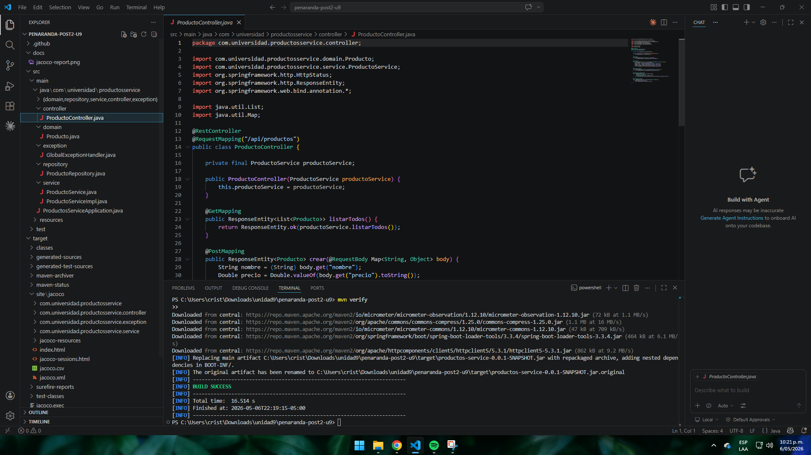
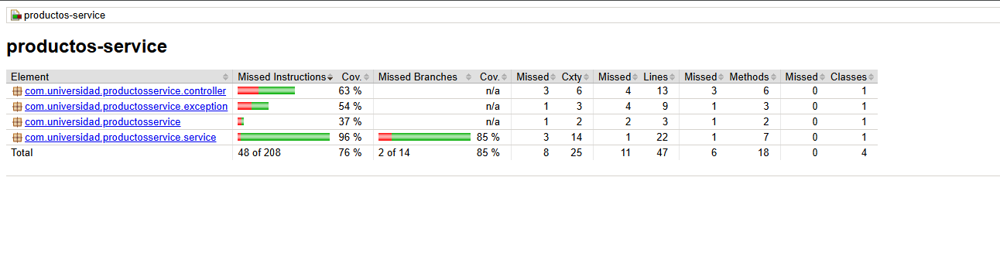

# penaranda-post2-u9


**Patrones de Diseño de Software — Unidad 9: Pruebas Unitarias y de Integración**  
**Post-Contenido 2 — Pruebas de Integración y GitHub Actions CI**  
**Estudiante:** Cristian Alonso Peñaranda Parra — 02230131010  
**Programa:** Ingeniería de Sistemas — UDES  
**Año:** 2026

---

## Descripción

Microservicio de gestión de productos con Spring Boot 3.3.x que implementa:

- Pruebas **unitarias** con JUnit 5 + Mockito (`@Mock`, `@InjectMocks`, `@ParameterizedTest`, `ArgumentCaptor`)
- Pruebas de **integración de persistencia** con `@DataJpaTest` contra H2 en memoria
- Pruebas de **integración de la capa web** con `@WebMvcTest` + `MockMvc`
- **Pipeline CI** con GitHub Actions que ejecuta todas las pruebas en cada push
- **Reporte de cobertura** generado automáticamente con JaCoCo (≥70% en capa de negocio)

---

## Tecnologías

- Java 21
- Spring Boot 3.3.4
- Spring Data JPA + H2 (in-memory)
- Lombok
- JUnit 5 + Mockito + MockMvc
- JaCoCo 0.8.11
- Maven 3.8+
- GitHub Actions

---

## Estructura del Proyecto

```
src/
├── main/
│   └── java/com/universidad/productosservice/
│       ├── ProductosServiceApplication.java
│       ├── domain/
│       │   └── Producto.java
│       ├── repository/
│       │   └── ProductoRepository.java
│       ├── service/
│       │   ├── ProductoService.java
│       │   └── ProductoServiceImpl.java
│       ├── controller/
│       │   └── ProductoController.java
│       └── exception/
│           └── GlobalExceptionHandler.java
└── test/
    ├── java/com/universidad/productosservice/
    │   ├── service/
    │   │   └── ProductoServiceImplTest.java   (11 tests — Mockito)
    │   ├── repository/
    │   │   └── ProductoRepositoryTest.java    (4 tests — @DataJpaTest)
    │   └── controller/
    │       └── ProductoControllerTest.java    (3 tests — @WebMvcTest)
    └── resources/
        └── application-test.properties
```

---

## Pruebas Implementadas

### Unitarias — `ProductoServiceImplTest` (11 tests)

| Método | Tipo |
|---|---|
| `crear_datosValidos_retornaProductoGuardado` | Happy path |
| `buscarPorId_existente_retornaProducto` | Happy path |
| `buscarPorId_noExistente_lanzaRuntimeException` | Negativo |
| `crear_nombreInvalido_lanzaIllegalArgumentException` | Parametrizado |
| `crear_precioInvalido_lanzaIllegalArgumentException` | Parametrizado |
| `crear_stockNegativo_lanzaIllegalArgumentException` | Negativo |
| `crear_nombreConEspacios_guardaNombreNormalizado` | ArgumentCaptor |
| `eliminar_productoExistente_llamaDeleteById` | Verificación |
| `eliminar_productoNoExistente_lanzaRuntimeException` | Negativo |
| `actualizarStock_valido_retornaProductoActualizado` | Happy path |
| `actualizarStock_stockNegativo_lanzaIllegalArgumentException` | Negativo |

### Integración JPA — `ProductoRepositoryTest` (4 tests)

| Método | Descripción |
|---|---|
| `save_asignaIdAutomaticamente` | Verifica generación de ID |
| `findById_existente_retornaProducto` | Búsqueda por ID |
| `findAll_retornaListaCompleta` | Lista todos los productos |
| `deleteById_eliminaProducto` | Eliminación persistida |

### Integración Web — `ProductoControllerTest` (3 tests)

| Método | HTTP |
|---|---|
| `listarProductos_retorna200ConLista` | GET 200 |
| `crearProducto_datosValidos_retorna201` | POST 201 |
| `buscarProducto_noExistente_retorna404` | GET 404 |

---

## Cómo ejecutar

```bash
# Solo pruebas unitarias
mvn test

# Pruebas + reporte de cobertura JaCoCo
mvn verify

# Abrir reporte en el navegador (Windows)
start target\site\jacoco\index.html
```

---

## Evidencia de Pruebas

> *(Agregar captura de pantalla del resultado de `mvn test` con BUILD SUCCESS)*



---

## Cobertura JaCoCo

> *(Agregar captura del reporte JaCoCo mostrando ≥70% en ProductoServiceImpl)*


